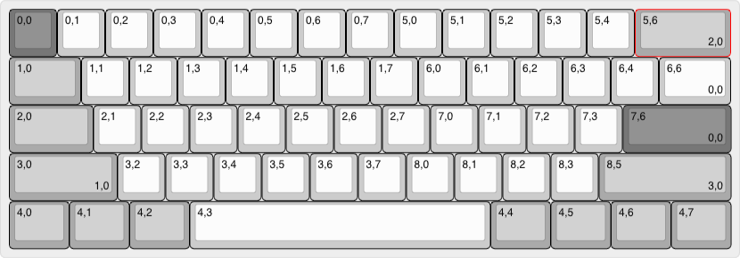

# Welcome to tecsmith.design

## <i class="far fa-question-circle"></i> About

On this site you will find Vino Rodrigues' custom keyboard and home automation device designs.

The intent here is one of education. My hope is that you will be inspired to create your own electronics and embeded software products.

All my personal *(non-commissioned)* projects will be hosted here *(or rather on Github)*.

The tools I use currently are:

- EAGLE CAD, for electronics schematics and PCB design
- QMK, for firmware builds
- Fusion 360, for case design

## <i class="far fa-comment"></i> Contact me

#### If it's for keyboards

Please reach out to me on Discord on either the [**QMK** server](https://discord.gg/qmk) or the [**Keyboard Atelier** server](https://discord.gg/b7vwhHS).

DM me (<code>@vinorodrigues</code>), and be direct: say what you want and a brief elaboration. And FHS, [don't ask to ask](https://dontasktoask.com).

> <i class="fas fa-exclamation-triangle"></i> **BE WARNED:**  I seldom do *"commissions"*, and when I do, they're *<ins>usually</ins>* pro-bono, and with the condition that it's open-source.

#### If it's for home/<abbr title="Small and Medium-sized Business">SMB</abbr> automation

Reach me by visiting the contact page on [tecsmith.au](https://tecsmith.au).

## <i class="far fa-keyboard"></i> The goodies

| Project Name |  | Availability | Status |
|---|:---:|---|---|
| VR61 Keyboard PCB   *ft.* SparkFun MicoMod |  | Open Source   [tecsmith/vr61-keyboard-pcb](https://github.com/tecsmith/vr61-keyboard-pcb) | Successful build |
| VR61 Keyboard firmware |  | Open Source   [tecsmith/vr61-keyboard-qmk](https://github.com/tecsmith/vr61-keyboard-qmk) | Working   Not merged to up-stream / won't |
| VR42 Keyboard PCB   *ft.* 8MHz polling HS-USB |  | Open Source   [tecsmith/vr42-keyboard-pcb](https://github.com/tecsmith/vr42-keyboard-pcb) | **UNDER DEVELOPMENT**   Design compleated   NOT prototyped   NOT tested |
| VR99 Keyboard PCB   *ft.* direct key   &nbsp; *(no matrix)* scanning |  | Open Source   [tecsmith/vr99-keyboard-pcb](https://github.com/tecsmith/vr99-keyboard-pcb) | **UNDER DEVELOPMENT**   Design compleated   NOT prototyped   NOT tested |
| VR44 Keyboard PCB   *a.k.a. Companion*   *ft.*   &nbsp; - RT Clock   &nbsp; - Calc mode   &nbsp; - 3A USB hub |  | Open Source   [tecsmith/vr44-keyboard-pcb](https://github.com/tecsmith/vr44-keyboard-pcb) | **UNDER DEVELOPMENT**   Ideation stage only |
